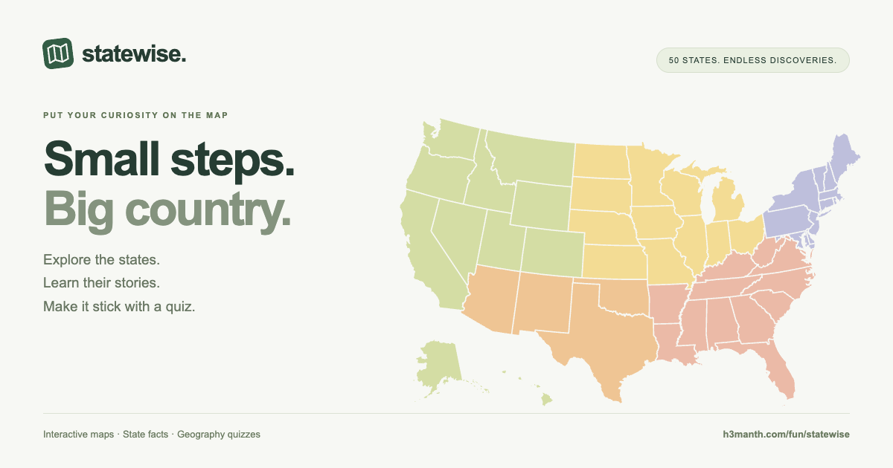

# Statewise

An interactive field guide to the 50 United States, built with React and Vite.

[Open Statewise](https://h3manth.com/fun/statewise/) · [Watch the demo](https://h3manth.com/fun/statewise/statewise-demo.mp4)



## Run locally

```sh
npm install
npm run dev
```

Open http://127.0.0.1:5173/fun/statewise/. Use `npm run build` for a production build and `npm run preview` to preview it.

## Features

- Interactive SVG map with Alaska and Hawaii insets, small-state shortcuts, labels, zoom, and region filters
- Search by state name, abbreviation, or capital
- State capitals, nicknames, admission years, and learned-state bookmarks
- Location, capital, and nickname quizzes with immediate feedback
- Progress saved in this browser using localStorage
- Responsive layouts, keyboard controls, and reduced-motion support

The five regions are learning groups, not the four official Census regions. Geographic geometry is bundled from us-atlas (Albers projection). The California photo uses Unsplash; typography uses Google Fonts. Those visual resources need an internet connection. Core state data and map geometry are bundled with the app.

## Browser smoke checks

With the development server running, run `npm test`. The test uses local Google Chrome on macOS; set `CHROME_PATH` to a different Chrome executable when needed. It verifies responsive widths, the map, search, region filters, quizzes, and persisted progress.

## Metadata and agent discovery

The static HTML includes canonical, Open Graph, Twitter Card, and WebApplication JSON-LD metadata. The social preview is a 1200×630 PNG. SVG/PNG favicons, an Apple touch icon, and a web manifest are included.

- `public/llms.txt`: human-readable and agent-readable app guide, linked with `rel="describedby"`
- `public/app.json`: machine-readable capabilities and data links
- `public/states.json`: all 50 state records, without requiring JavaScript
- `public/sitemap.xml`: canonical app URL

These make the app easier to discover and read; they do not guarantee search indexing or agent support. No MCP server or backend API is advertised.

## Media

`node scripts/generate-assets.mjs` regenerates the social image and app icons. `node scripts/record-demo.mjs` records real browser interactions; its timeline is saved under `media/`. Run `sh scripts/render-demo.sh` (requires FFmpeg) to add smooth zooms and export `public/statewise-demo.mp4`. Both scripts use `CHROME_PATH` when set.

## Deployment

Vite builds for `/fun/statewise/`. Run `npm run build`, then copy the contents of `dist/` to the server's `fun/statewise/` directory. Preview with `npm run preview` and open `/fun/statewise/` under the preview URL. The app does not require a Node server in production.

## Geographic data attribution

Map geometry is distributed with us-atlas, copyright 2013–2019 Michael Bostock. Its permission notice is included in `public/US-ATLAS-LICENSE.txt` and the deployed files.
